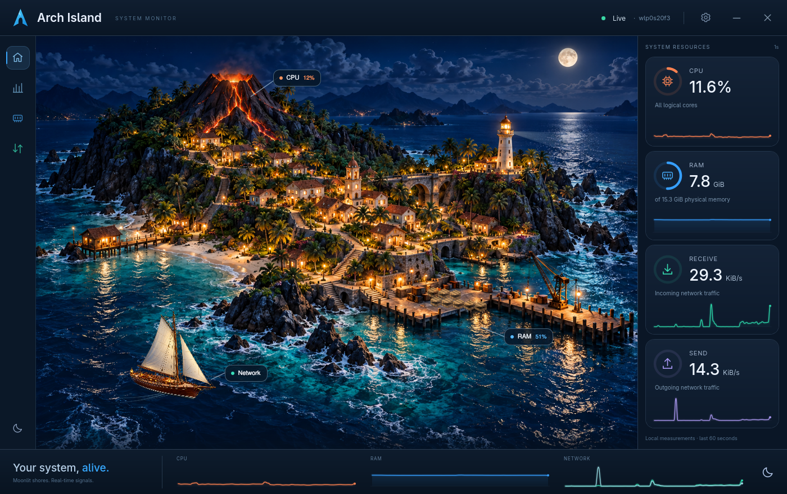

# Arch Island

Нативний монітор Linux на C++20, Qt 6 / Qt Quick і QML: стан комп’ютера відображається як живий карибський острів. Вулкан реагує на CPU, вантаж у порту — на RAM, вітрильник — на сумарну активність приймання й передавання **одного** інтерфейсу. Маяк світить уночі. Праворуч розміщені числові показники.



Детальна художня сцена з окремими денним і нічним шарами, прозорим вітрильником, власними SVG-ефектами та анімаціями властивостей Qt Quick. Зображення концепту не використовується як інтерфейс: усі кнопки, показники, графіки та підписи відображає Qt. Жодних мережевих запитів застосунку, телеметрії, root-прав, керування процесами чи змін системи. Інтерфейс MVP англійською. Походження ресурсів і промпти: [docs/art-direction.md](docs/art-direction.md).

## Залежності й збирання

Linux з доступним `/proc`, компілятор C++20, CMake ≥ 3.21, Ninja або Make та Qt ≥ 6.4: Core, Gui, Qml, Quick, QuickControls2, Svg, Concurrent; для тестів — Qt Test. Збирання не завантажує залежності.

На Arch Linux:

```sh
sudo pacman -S --needed base-devel cmake ninja git qt6-shadertools qt6-base qt6-declarative qt6-svg qt6-wayland
cmake -S . -B build -G Ninja -DCMAKE_BUILD_TYPE=Release
cmake --build build
ctest --test-dir build --output-on-failure
./build/arch-island
```

Застосунок підтримує Qt-платформи Wayland та X11. Якщо потрібно примусово вибрати платформу:

```sh
QT_QPA_PLATFORM=wayland ./build/arch-island
QT_QPA_PLATFORM=xcb ./build/arch-island
```

Qt автоматично масштабує інтерфейс для HiDPI. Мінімальний розмір — 800 × 640 логічних пікселів. Для короткої перевірки запуску є `--smoke-test` (автоматичне закриття за 4 секунди).

## Використання й точність

- Натисніть на вулкан, порт або кнопку Processes. Процеси сортуються за CPU чи RSS. Список оновлюється приблизно раз на 2 секунди **лише коли панель відкрита**, у фоновому потоці. Показано до 200 перших процесів; недоступні й завершені процеси пропускаються.
- Загальний CPU — частка всіх логічних ядер за різницею перших восьми лічильників `/proc/stat`; guest/guest_nice не додаються вдруге. Idle включає iowait. Перше вимірювання, нульова різниця та зменшення лічильника дають Unavailable.
- **CPU процесу: 100% = повне використання одного логічного ядра.** Багатопотоковий процес може перевищувати 100%. Перше вимірювання відображається як «—». Ідентичність визначається парою PID + starttime; повторне використання PID не створює стрибок навантаження.
- Використана RAM = MemTotal − MemAvailable із `/proc/meminfo`. GiB/MiB/KiB — двійкові одиниці. RSS процесів включає спільні сторінки, тому їхня сума не дорівнює загальній використаній RAM.
- Мережеві швидкості — різниця байтових лічильників `/proc/net/dev`, поділена на фактичний інтервал `std::chrono::steady_clock`. Виберіть інтерфейс у Settings. Automatic спочатку шукає IPv4 default route, потім фізичний пристрій, потім один із доступних інтерфейсів. Вибір стабільний до його зникнення; loopback виключено з UI. Трафік інтерфейсів не підсумовується.
- Після зміни інтерфейсу, його появи після зникнення чи помилки читання потрібні два вимірювання. Скидання кожного напрямку обробляється окремо. Вручну вибраний відсутній інтерфейс залишається вибраним і показує Unavailable. Вибір застосовується на наступному секундному вимірюванні.
- Settings: Day, Night або Automatic (ніч 19:00–07:00 за локальним годинником); Reduce decorative animation. Анімації також зупиняються при мінімізації. Збір показників продовжується.
- QSettings зберігає налаштування у стандартній конфігурації користувача: зазвичай `~/.config/ArchIsland/arch-island.conf`, з урахуванням `XDG_CONFIG_HOME`.

Сцена заповнює область перегляду без бічних смуг і спотворення пропорцій; вантаж на причалі є частиною оригінального зображення. Вода, хмари, зелень і нічні вогні мають м’який рух на GPU; над містом літають птахи, у порту рухаються люди. Човен безперервно проходить замкнений маршрут із плавним розворотом і хитанням. Зміни трафіку поступово впливають на швидкість, а пауза зберігає позицію. На програмному рендері Qt ефекти води й рослинності недоступні; рух окремих об’єктів зберігається.

Декоративні реакції показують тенденцію, точні значення наведено у картках. Швидкість човна має логарифмічну шкалу й обмежена для читабельності. MVP вимірює трафік інтерфейсу, а не VPN-статус чи прогрес окремого завантаження. Графіки зберігають у RAM лише останні 60 справжніх секундних вимірювань; після запуску поступово заповнюються справа. Недоступні вимірювання утворюють прогалини, зміна інтерфейсу очищує його графіки. Довготривалої історії чи журналів на диску немає.

## Встановлення

```sh
cmake -S . -B build -G Ninja -DCMAKE_BUILD_TYPE=Release -DCMAKE_INSTALL_PREFIX=/usr
cmake --build build
DESTDIR="$PWD/stage" cmake --install build
(cd /tmp && /path/to/arch-island/stage/usr/bin/arch-island --smoke-test)
```

`stage` — перевірка встановлення без системних змін. Для встановлення у власний профіль:

```sh
cmake -S . -B build -DCMAKE_INSTALL_PREFIX="$HOME/.local"
cmake --build build
cmake --install build
"$HOME/.local/bin/arch-island"
```

Назва команди — `arch-island`. Встановлюються бінарник, desktop entry, SVG-іконка та MIT-ліцензія. QML і всі зображення вбудовані в бінарник через Qt Resources; поточний каталог не впливає на запуск. Qt-бібліотеки та їхні системні плагіни залишаються runtime-залежностями.

## Архітектура й тести

`src/metrics.*` — парсери, різниці лічильників, сканування процесів; `src/monitor.*` — секундний таймер, фонові завдання й QObject-властивості; `src/processmodel.*` — QAbstractListModel; `src/settings.*` — QSettings; `src/history.h` — обмежена історія; `src/charts.*` — невеликі QQuickPaintedItem-графіки та кільцеві індикатори; `qml/` — UI; `assets/art/` — художні PNG-шари; `assets/icons/` та `assets/*.svg` — власні векторні елементи. Графіки перемальовуються лише при новому вимірюванні чи зміні розміру/властивостей. Детальна сцена є статичною текстурою, анімуються тільки окремі невеликі шари. Об’єкти мають стекове або Qt-власництво. Фонове завдання повертає окремий знімок, який модель отримує тільки в GUI-потоці. Одночасно виконується не більше одного сканування; після закриття панелі його результат відкидається. При виході застосунок чекає завершення вже запущеного сканування.

Qt Test перевіряє CPU/RAM, назви процесів із пробілами й дужками, PID reuse, завершення процесів, відмови читання, мережеві інтервали/скидання/зникнення/зміну інтерфейсу та ізольоване збереження налаштувань. GUI-тест виконує кліки по острову, перевіряє список процесів, режими, малий розмір і мінімізацію.

`ctest` запускає GUI-тест **offscreen із software rendering**: це перевірка інтеграції, а не доказ роботи реального дисплея. Для дисплея:

```sh
QT_QPA_PLATFORM=wayland ./build/island-gui-tests
QT_QPA_PLATFORM=xcb ./build/island-gui-tests
QT_SCALE_FACTOR=2 QT_QPA_PLATFORM=offscreen QT_QUICK_BACKEND=software ./build/island-gui-tests
```

Результати перевірок і вимірювань цього середовища: [docs/validation.md](docs/validation.md).

## AUR

Файли [packaging/aur/](packaging/aur/) призначені для **окремого AUR Git-репозиторію** `arch-island-git`, а не для публікації всього upstream-проєкту в AUR. PKGBUILD має runtime depends, makedepends, `pkgver()`, Release `build()`, `check()` та `package()` через DESTDIR.

Upstream із `git remote`: `git@github-temp2003late:temp2003late/arch-island.git`. Це локальний SSH-аліас; публічне HTTPS-джерело пакета: `https://github.com/temp2003late/arch-island.git`. На початку роботи локальна гілка не мала комітів, а upstream не повертав файлів. Перед пакетним збиранням власник має опублікувати вихідні файли й перевірити HTTPS-клонування. Початковий `pkgver` — placeholder, який `makepkg` замінить після отримання Git-джерела.

05.10.2026 [офіційний AUR RPC](https://aur.archlinux.org/rpc/v5/info?arg[]=arch-island-git&arg[]=arch-island) повернув `resultcount: 0` для обох назв. Це перевірка на цей момент, а не резервування назви. Залежності перевірено на офіційних сторінках Arch: [qt6-base](https://archlinux.org/packages/extra/x86_64/qt6-base/), [qt6-declarative](https://archlinux.org/packages/extra/x86_64/qt6-declarative/), [qt6-svg](https://archlinux.org/packages/extra/x86_64/qt6-svg/), [qt6-wayland](https://archlinux.org/packages/extra/x86_64/qt6-wayland/), [cmake](https://archlinux.org/packages/extra/x86_64/cmake/), [ninja](https://archlinux.org/packages/extra/x86_64/ninja/), [git](https://archlinux.org/packages/extra/x86_64/git/).

Перед публікацією:

```sh
cd packaging/aur
makepkg --printsrcinfo > .SRCINFO
makepkg --cleanbuild --check
```

`.SRCINFO` згенеровано справжнім `makepkg --printsrcinfo`. Повний цикл `makepkg` із тимчасовим локальним Git-джерелом пройшов; upstream-збирання й clean-chroot build ще не перевірено. Подробиці обмежень перевірки наведені в docs/validation.md. Перевірте пакет у чистому Arch chroot, актуальність назви й дані Maintainer, потім перенесіть PKGBUILD та `.SRCINFO` до окремого AUR-репозиторію. Жодної публікації, push або релізу під час реалізації не виконано.

## Обмеження й ліцензія

MVP для Linux; немає температур, GPU, дисків, per-core графіків, довготривалої історії, окремих завантажень або керування процесами. `/proc` із hidepid чи обмеженнями доступу показує лише доступні процеси. Автоматичний вибір мережі не аналізує IPv6-маршрути й складні policy routing правила — у таких випадках виберіть інтерфейс вручну. Сцена використовує детальні двовимірні художні шари; повноцінного 3D-рушія немає. Шрифт Adwaita Sans використовується за наявності, інакше Qt вибирає доступний системний шрифт.

MIT, copyright © 2026 temp2003late, як зазначено в [LICENSE](LICENSE). Користувацьке зображення концепту залишено без змін і не вбудовано в застосунок; наявність файлу не означає передачі прав на нього.
